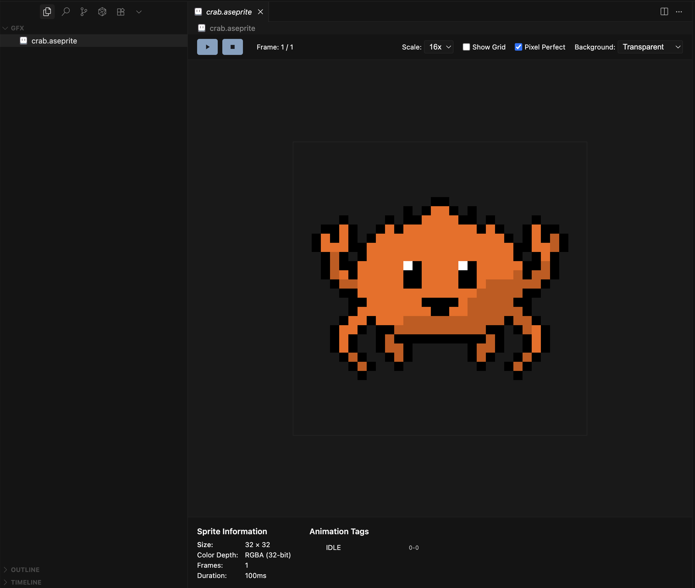

# Aseprite Preview

[](https://marketplace.visualstudio.com/items?itemName=grimaldi-tech.aseprite-preview)
[](https://marketplace.visualstudio.com/items?itemName=grimaldi-tech.aseprite-preview)
[](https://opensource.org/licenses/MIT)

Visual Studio Code / Cursor extension for quick previews of [Aseprite](https://github.com/aseprite/aseprite) pixel art files (`.aseprite` and `.ase`). Only meant for a quick look at a sprite to save having to open it fully in Aseprite.



## Features

- 🎨 View `.aseprite` and `.ase` files directly in VS Code
- 🎬 Play animations with frame controls
- 🔍 Zoom from 1x to 16x
- 📊 Show sprite info (size, frames, layers)
- 🎯 Toggle between smooth and pixel-perfect rendering
- 🎭 Multiple background options
- 📸 Export current frame as PNG

## Installation

Install from the [VS Code Marketplace](https://marketplace.visualstudio.com/items?itemName=grimaldi-tech.aseprite-preview) or search for "Aseprite Preview" in the Extensions view.

## Usage

Just click on an `.aseprite` or `.ase` file in VS Code. Use the toolbar to play animations, zoom, and adjust settings.

## Development

```bash
npm install
npm run compile
# Press F5 to test
```

Built from scratch with zero external dependencies using the [official Aseprite file format specification](https://github.com/aseprite/aseprite/blob/main/docs/ase-file-specs.md).

## License

[MIT](./LICENSE)

## Contributing

Contributions are welcome! Whether it's bug fixes, feature additions, or documentation improvements, we appreciate your help in making this project better. For major changes or new features, please open an issue first to discuss what you would like to change.
